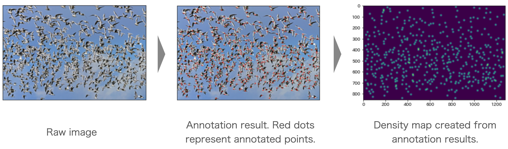

[](LICENSE)
[](https://github.com/kenya-sk/density-annotator/actions/workflows/build_container.yaml)

# DensityAnnotator
DensityAnnotator is a GUI-based annotation tool that creates a density map for an image.
Not only image data but also video data can be handled, and it can be cut out into a frame at any timing and annotated in the same way as for images.

It's easy to use, just set the input / output in the config file, then left-click the object in the image with the mouse.
After annotation, the raw image, the image with annotated points, the coordinate information of the annotated object, and the density map are saved for each image.



## Getting Started
### Annotation Process
Getting up and running with DensityAnnotator is easy.
Execute the following command to bring up the GUI window.

```bash
# create develop environment by poetry
poetry install

# run DensityAnnotator
bash scripts/run_annotator.sh
```

The keys that can be executed on the GUI are as follows.
```
q key: "quit" the annotation work. Close the GUI window.
p key: "pause" the video and cut out the frame. this key is used only for video data.
d key: "delete" previous feature point. this key is used when annotation fails.
s key: "save" current annoatetion rusult
```

### Frame Sampling
If you need to convert video data to image data in advance, here are the steps to follow.

First, set up the config file. The config file is located at `conf/frame_sampling.yaml` and the parameters are as follows.
```
sample_rate          : frequency of random sampling of the image (in frames)
path/input_video_list: list of video data paths to be input
path/save_frame_dirc : directory for saving image data 
```

Finally, the image data can be extracted by executing the following command.
```bash
bash scripts/run_sampler.sh
```