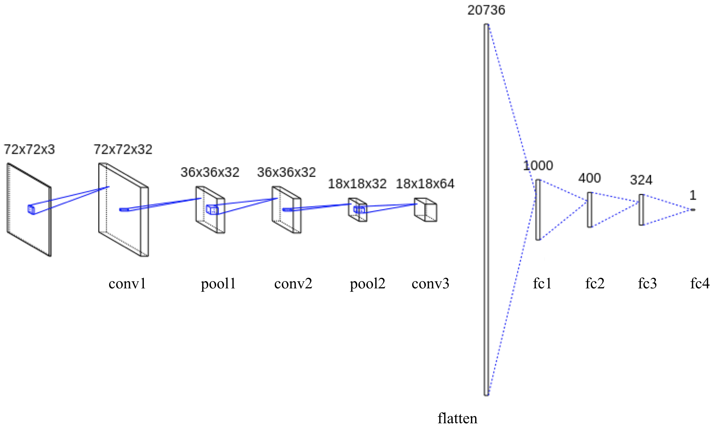

[](LICENSE)
[](https://github.com/kenya-sk/deep-individual-tracker/actions/workflows/detection_test.yaml)

# Deep Individual Tracker / Indeividual Detection
## Introduction
This repository performs individual detection in consideration of overlap by using CNN (Convolutional Neural Network) in each pixel.


## Model Architecture
This model consists of three convolution layers (conv1-conv3), two max-pooling layers (pool1 and pool2), and four fully connected layers (fc1-fc4). Conv1 has 7×7×3 filters, conv2 has 7×7×32 filters and conv3 has 5×5× 32 filters. Max pooling layers with 2×2 kernel size are used after conv1 and conv2. Batch normalization was applied to conv1-con3 and fc1-fc3. The activate function was applied after every convolutional layer and fully connected layer by Leaky ReLU.


## Getting Started
### Execution Environment
Build a GPU-enabled environment with Docker Compose. The directory of `/data` was mounted by docker-compose.

``` bash
# launch containers in a GPU environment
$ docker-compose -f docker-compose.yaml exec detection-gpu /bin/bash
``` 

The following python code can be used to check if a GPU is available.
``` python
from tensorflow.python.client import device_lib
device_lib.list_local_devices()
```

## Create Datasets
An annotation tool (**DensityAnnotator**) is provided to create datasets consisting of pairs of images and density maps. For details on how to use this tool, please refer to the following page.

**Documentation of DensityAnnotator**: https://github.com/kenya-sk/density-annotator

## Training Your Own Model
The created dataset is used to build a machine learning model. The architecture of the model is defined in `src/model.py`.

The following technique was used to train the model.
- Down Sampling
- Early Stopping
- Batch Normalization
- Data Augmentation (Horizontal flip)
- Hard Negative Mining

### Training
Parameters must be preconfigured in config to train the model. The config file for training is defined in `conf/train.yaml`. The details of the parameters are supplemented with comments in the file.

Once the config settings are complete, you can run the model training with the following command. In the script, `src/train.py` is executed.

``` bash
bash scripts/train.sh
```

### Prediction
Using the trained model, prediction can be run on new data with the following commands. In the script, `src/predict.py` is executed.
Each parameter can be defined in `conf/predict.yaml`.

```bash
bash scripts/predict.sh
```

### Evaluation
The evaluation metrics of individual detection are accuracy, recall, precision, and F-measure. The position of the individual predicted by CNN and the position of the answer label were associated by using the Hungarian algorithm. True Positive defined ad If the matching distance was less than or equal to the threshold value (default is 15).
Each parameter can be defined in `conf/evaluate.yaml`.

```bash
bash scripts/evaluate.sh
```

### Monitoring by TensorBoard
The training log is output by default so that it can be visualized in TensorBoard.

``` bash
LOG_DIRECTORY = "/data/tensorboard"
tensorboard --logdir "${LOG_DIRECTORY}"
```
