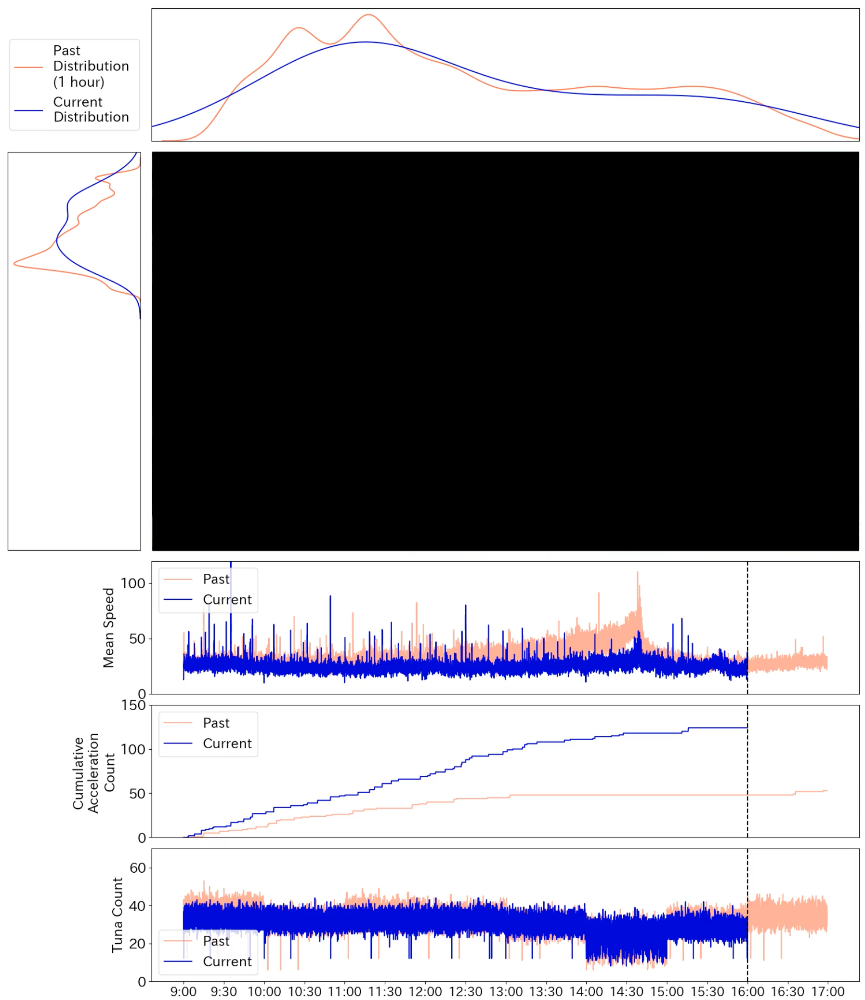

# Deep Individual Tracker / Statistic Monitoring

## Overview

The system provides a monitoring environment with the following statistical information added to the video.
- Histogram of X-axis and Y-axis position information of each individual tuna
- Time series plot of average cruising speed
- Time-series plot of the cumulative number of sudden accelerations
- Time series plot of the number of individuals detected by the machine learning model

The system can set the following two options for the video.
- Whether to display the position of the detected individual as a dot
- Whether to display a two-dimensional probability density map



## Execution Environment
The execution environment can be build using Docker Comopse. The directory of `/data` was mounted by docker-compose.

``` bash
# launch countainer
$ docker-compose exec monitoring /bin/bash
```